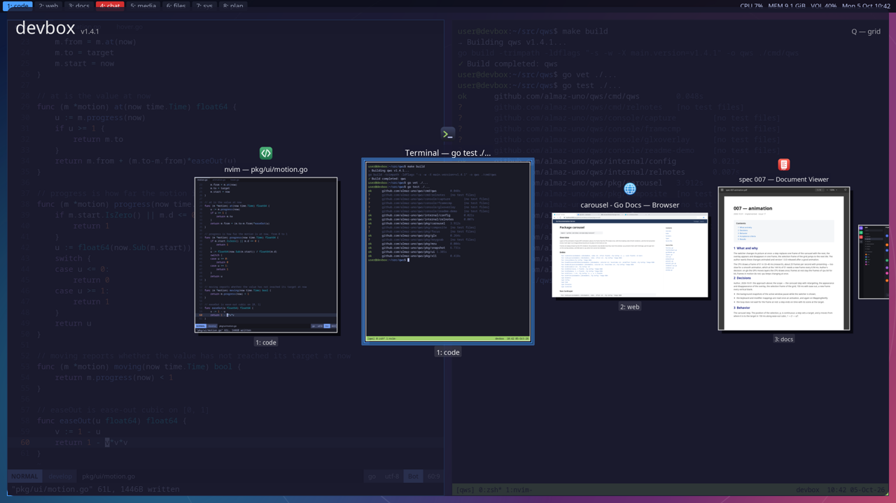
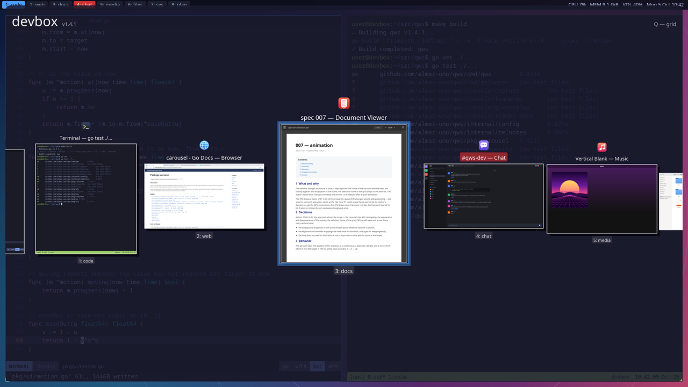
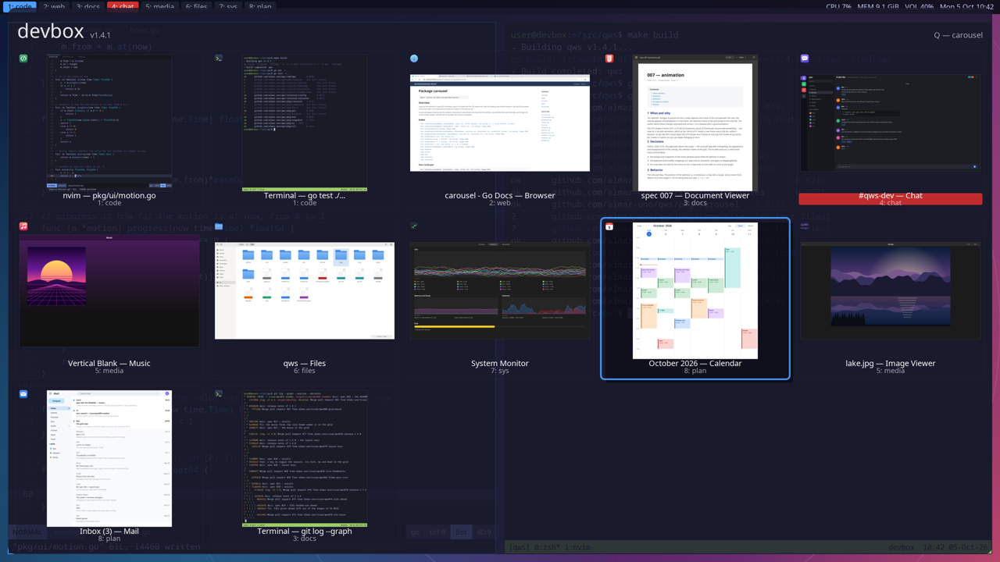

<p align="center">
  
  <br><sub>Every frame drawn by qws's own renderer, off the screen, from synthetic windows —
  <a href="console/readme-demo">console/readme-demo</a>, <code>make readme-images</code>.</sub>
</p>

<h1 align="center">qws</h1>

<p align="center"><b>Alt+Tab for X11 that keeps up with your monitor.</b><br>
A 2.5D carousel and a grid of live window thumbnails, animated on the GPU<br>
at the refresh rate — every frame on time at 144 Hz.</p>

---

- **On time at 144 Hz.** A step through the carousel presents a frame every
  6.94 ms: the interval between frames is 7.09–7.10 ms at p95, and
  0.45–0.51 % of them miss a vertical blank, on 2560×1440 at 144 Hz
  ([007](specs/007-animation/spec.adoc)).
- **Exact at rest.** When the motion stops, the frame the GPU shows is the
  frame of the CPU drawing byte for byte, for every scene of the test set
  ([001](specs/001-rendering-speed/spec.adoc),
  [007](specs/007-animation/spec.adoc)).
- **Live.** While the switcher is shown, the thumbnails of windows that
  change follow them: a change reaches its card within some 53 ms at p95,
  for some 2 % of one CPU ([020](specs/020-live-thumbnails/spec.adoc)).
- **Quick to open.** The first frame comes some 120 ms after the key,
  instead of 345 ms before qws kept its own model of the windows
  ([003](specs/003-window-list/spec.adoc)).

## Install

qws is one binary. Download the latest release and check it:

```bash
curl -LO https://github.com/almaz-uno/qws/releases/latest/download/qws-linux-amd64
curl -LO https://github.com/almaz-uno/qws/releases/latest/download/SHA256SUMS
sha256sum -c SHA256SUMS
sudo install -m 755 qws-linux-amd64 /usr/local/bin/qws
```

Run it as a `systemd --user` service, `~/.config/systemd/user/qws.service`:

```ini
[Unit]
Description=qws window switcher
After=graphical-session.target
PartOf=graphical-session.target

[Service]
ExecStart=/usr/local/bin/qws
Restart=on-failure
RestartSec=30

[Install]
WantedBy=graphical-session.target
```

and start it with your session — in i3:

```
exec --no-startup-id systemctl --user import-environment DISPLAY XAUTHORITY DBUS_SESSION_BUS_ADDRESS && systemctl --user restart qws.service
```

Or simply put `qws` in the autostart of your window manager.

**Needs:** X11 and a window manager with EWMH (i3, bspwm, Openbox, Xfwm…);
a compositor such as picom for the thumbnails — without one, windows show
their icons; glibc 2.36 or newer (Debian 12 and later) and the OpenGL and
X11 libraries; the fonts of `appearance.font.paths`, Noto Sans and DejaVu
Sans by default. The `glx` renderer needs a direct OpenGL 4.6 core context
with a 32-bit ARGB visual; without one qws says so and draws with the CPU.

## Keys

| Key | What it does |
| --- | --- |
| `Alt+Tab` | open the switcher; again: the next window |
| `Alt+Shift+Tab` | the previous window |
| release `Alt`, `Enter` | switch to the selected window |
| `Esc` | close, the focus where it was |
| `←` `→` | previous, next — in the grid row after row |
| `↑` `↓` | in the grid: a row up or down within the column, around it |
| `q` | toggle the carousel and the grid, in the next frame; in the grid the selection frame converges onto the selected tile; the top right of the header says what `q` does now |
| `c`, `g` | the carousel, the grid |
| `Ctrl` | only the current workspace, or all of them, against `windows.workspace` |
| mouse | hover to highlight, click to switch |

The modifier, the key, `q` and the rest are configurable
(`keybindings.*`); the next activation opens in `appearance.layout` again.

## Features

<table>
  <tr>
    <td></td>
    <td></td>
  </tr>
</table>

- **Two layouts.** A Cover Flow–like carousel in perspective, the
  selection in the middle; a grid of every window at once.
- **Most recently used first,** as Alt+Tab should be.
- **Thumbnails of every visible window,** averaged on the GPU, kept
  current as windows change. Windows the window manager draws into their
  frame — xterm, Telegram, KeePassXC, Flutter apps on i3 — are taken from
  the frame by RENDER ([022](specs/022-uncaptured-windows/spec.adoc)).
- **Live thumbnails** with the `glx` renderer, only for what is in view and
  only while nothing moves (`appearance.thumbnail.live`, `live_interval`).
- **Animation** of every change — the step, the selection frame of the
  grid, the hover, the switcher appearing and going — with fades and zooms
  to taste (`appearance.animation`), or none. After a switch to the grid the
  selection frame comes in larger and shrinks onto the selected tile, so the
  eye finds it at once ([028](specs/028-grid-locate/spec.adoc)).
- **Workspaces:** all windows, the current workspace's, or all but it;
  `Ctrl` inverts the choice while the switcher is shown.
- **The monitor under the pointer** gets the switcher.
- **Dark and light themes,** or `auto`; colours, fonts, sizes, spacing and
  the header with the hostname and the version are configurable.
- **One YAML file, environment variables, flags** — the same keys in all
  three; `qws config init`, `qws config show`.
- **Two renderers:** `glx` (default) presents through OpenGL, `cpu` through
  `PutImage`; both draw with the same code and show the same picture.

## How it keeps 144 Hz

At 144 Hz a frame is due every 6.94 ms. The CPU draws a frame of the
carousel in 33–40 ms and, before [019](specs/019-grid-speed/spec.adoc), one
of the grid in 350–385 ms — far too slow to draw each frame of a motion.
So qws does not:

- **Layers, drawn once.** The CPU draws the cards, the tiles, the frames and
  the shadows as layers; the GPU composes them every frame. A card depends
  on its offset — its scale, the size of its title, even where the title is
  cut — so it is drawn at the integer offsets around the motion, and a card
  between two offsets is the cross-fade of the two
  ([007](specs/007-animation/spec.adoc)).
- **The frame at rest is the CPU's.** It is drawn in the background while
  the motion runs, staged into a second texture in pieces between frames,
  and swapped in: the motion ends on time and exactly.
- **A timer, not vsync.** The loop sleeps until 3 ms before a frame is due
  and spins the rest: a sleep wakes up to half a millisecond late.
- **Nothing in a frame's way.** Textures are uploaded in the pauses between
  frames; one frame at rest is drawn at a time; layers on at most half the
  CPUs; the keyboard mapping read once an activation; snapshots of windows
  paused while any switcher is shown
  ([011](specs/011-snapshot-pause/spec.adoc)). A stop of the Go collector of
  5.7 ms was a `memmove` of 14 MB, which cannot be preempted: images are now
  copied a row at a time through a call, and the pauses are 0.2–0.7 ms.
- **The grid in a ninth of the time,** the same bytes: the tiles drawn in
  parallel, a title cut in one pass over its runes — 43–48 ms instead of
  383–390 ([019](specs/019-grid-speed/spec.adoc)).
- **Both layouts ready.** While one layout is shown, the other's layers are
  drawn in the background: a switch shows it in the next frame, 0.4–2.4 ms
  after the key on the author's second machine at 165 Hz — the first of an
  activation some 38 ms, the GPU's first use of the textures — instead of
  76–97 ms for a frame of the CPU ([028](specs/028-grid-locate/spec.adoc)).
- **Live thumbnails out of the way:** no pass while frames come, one 30 ms
  after they stop; a window in a frame passed with 6 requests to the X
  server instead of 28 ([020](specs/020-live-thumbnails/spec.adoc),
  [023](specs/023-frame-pass-cost/spec.adoc)).

Every figure here was measured on the author's machine — 2560×1440 at
144 Hz, an RTX 4080 SUPER, i3 and picom — and the specification that
measured it says how.

## Configuration

`~/.config/qws/config.yaml`; flags win over environment variables
(`QWS_…`), which win over the file. `qws config init` writes the defaults.

```yaml
keybindings:
  modifier: Alt
  key: Tab
  layout_toggle: q          # "" for none

appearance:
  layout: carousel          # or grid
  renderer: glx             # or cpu
  thumbnail:
    live: true
    live_interval: 50ms
  colors:
    theme: auto             # auto, dark, light
  animation:
    duration: 150ms
    show: [fade, zoom]      # fade, zoom, both, or none
    hide: [fade, zoom]
    locate_duration: 400ms  # the selection frame converging after a switch to the grid; 0s: none
    locate_zoom: 1.6        # the scale it converges from

windows:
  workspace: all            # all, current, all-except-current
```

Every key, flag and variable: [doc/configuration.asciidoc](doc/configuration.asciidoc);
a full example: [config.yaml.example](config.yaml.example).

## Building

```bash
go build -o qws ./cmd/qws   # or: make build, which builds the version in
```

The build needs cgo: a C compiler, `pkg-config` and the OpenGL and X11
development packages — on Debian `libgl-dev` and `libx11-dev`
([scripts/debian-deps.sh](scripts/debian-deps.sh)). `make test` and
`make vet` run what CI runs on every push.

## How it is made

Every change starts as a specification in [specs/](specs/): what and why,
the decisions, and acceptance criteria that a test or a measurement on the
screen can check; the results are written into it before it is merged. The
rules are in [specs/constitution.adoc](specs/constitution.adoc). What each
release changed is in [RELEASE-NOTES.adoc](RELEASE-NOTES.adoc); releases are
[on GitHub](https://github.com/almaz-uno/qws/releases), each with a binary
built on Debian 12 and its checksum.

Inspired by [alttab](https://github.com/sagb/alttab).

## License

MIT
